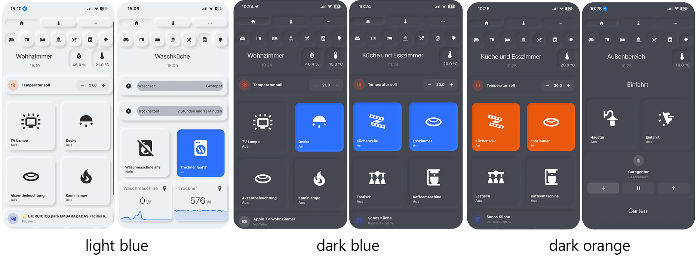

# Home Assistant Neumorphism Style

I created a Home Assistant Dashboard in a neumorphism style and wanted to share it with you.

It's based and inspired by the soft-ui from https://github.com/qiz-li/lovelace-soft-ui, where you can find different settings for the cards.

*Please be aware that this is a result of many copy & pasting and trial & error. It works for my setup and my smartphone, but you might get different results. Also, this is my first git repo and I'm not yet 100% familiar how this all works :D*

I hope you enjoy it!

Currently there are three themes, but the colors can be easily changed via the theme yaml code (see customization below):

## Requirements

- [card-mod](https://github.com/thomasloven/lovelace-card-mod) for the shadows, insets etc.
- [button-card](https://github.com/custom-cards/button-card) for the buttons
- [kiosk-mode(]https://github.com/maykar/kiosk-mode) to hide the top bar on mobile devices

## Cards I used

- [mini-graph-card](https://github.com/kalkih/mini-graph-card)
- [mushroom-card](https://github.com/piitaya/lovelace-mushroom)

## Customization

### Colors

The colors can be edited via the .yaml of the theme.

Use the `primary-background-color` for the main background color (obviously).

The `secondary-color` is for the colored accents like sliders and pressed buttons.

### Shadows

If you change the colors, you also have to edit the shadows.

I recommend to use https://neumorphism.io/ where you can dial in your desired background or accent color and it will generate the matching shadows.

You basically only need the color information from the code-block below on that site. Unfortunately you have to convert the HEX-Code of the color to RGB, otherwise it does not work.

The `soft-ui-pressed` variable is used for the pressed buttons that change their color when pressed (lights, switches etc.), so you have to take the `secondary-color` and put that into neumorphism.io to get the matching shadow colors.

The `soft-ui-inset` variable is used for the pressed buttons that don't change their color (in my dashboard for example the buttons to switch between the views), so you have to insert the `primary-background-color` into neumorphism.io to get the matching shadow colors.

